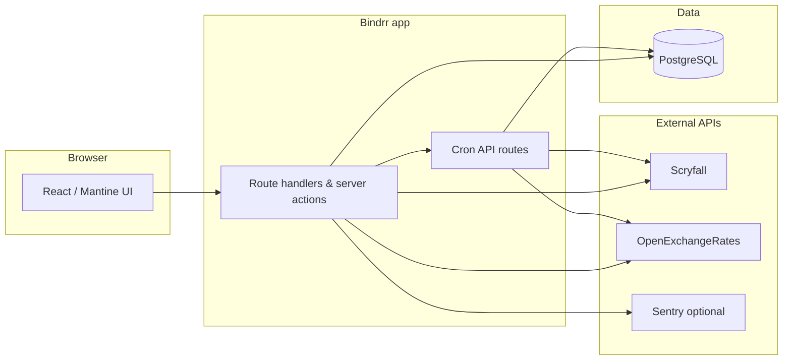

# Architecture

Bindrr v3 is a Next.js App Router application backed by PostgreSQL. External services supply card metadata, prices, and fiat exchange rates.

## Component overview

## Major pieces

| Piece | Role |
| --- | --- |
| **Next.js app** | Server-rendered pages, JSON APIs under `/api/*`, session cookies (`AUTH_SECRET`) |
| **PostgreSQL** | Users, collection, cached sets, printing prices, exchange rates |
| **Scryfall** | Card search, printing metadata, USD price hints |
| **OpenExchangeRates** | Daily fiat rates (`OPENEXCHANGERATES_APPID`) |
| **In-process scheduler** | Production Node runtime; same logic as `/api/cron/*` HTTP routes |
| **Sentry** | Optional via `PUBLIC_SENTRY_DSN` |
| **Umami** | Optional page views via `PUBLIC_UMAMI_WEBSITE_ID` + `PUBLIC_UMAMI_SCRIPT_URL` |

## Authentication model

There is no registration flow. Administrators create users directly in the database (see [operations](operations.md#creating-users)). Sessions are HTTP-only cookies signed with `AUTH_SECRET`. Edge middleware enforces sessions on collection pages and protected APIs; `/api/cron/*` is public at the middleware layer and still requires `Authorization: Bearer <CRON_SECRET>` in each route handler.

## Price sync

`/api/cron/sync-prices` walks collection printings in batches (Scryfall rate limits apply inside the client). `/api/cron/update-rates` refreshes stored exchange rates. Both require `Authorization: Bearer <CRON_SECRET>`.
